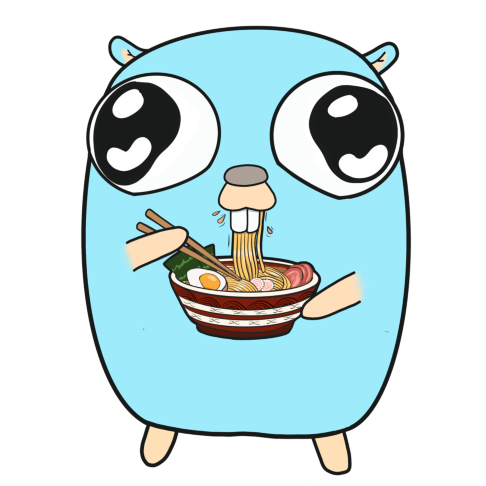

<p align="center">
    
</p>

<h1 align="center">umago</h1>

<p align="center">
    Umami tracking inside of your Go application.
</p>

```go
import "github.com/yuriizinets/umago"
```

This library allows to track events into [Umami](https://umami.is) inside of your Go application.

Use cases:

- Server-side events tracking
- Bring-your-own-tracker option
- Bypass Google _"malicious"_ tracking protection
- Track completely custom/insane things (f.e. use Umami to track CLI app usage)

## Usage

Just a set of simplest examples to provide you with umago usage.
These examples are not covering all provided features,
so feel free to explore sources and godoc.

### Middleware

Example using middleware:

```go
package main

import (
	"net/http"

	"github.com/yuriizinets/umago"
)

var (
	// Define umago configuration
	umagoConfiguration = umago.Configuration{
		Href:    "https://umami.foo.bar", // Provide your Umami instance url here
		Website: "test",                  // Provide your website id here
	}
	// Initialize umago middleware
	umagoMiddleware = umago.NewMiddleware(umagoConfiguration)
)

// simple page handler that we want to track
func page(w http.ResponseWriter, r *http.Request) {
	w.Write([]byte(`It's a simple text page!`))
}

func main() {
	// Register page
	http.HandleFunc("/", umamiMiddleware(page))

	// Serve
	if err := http.ListenAndServe(":8000", nil); err != nil {
		panic(err)
	}
}
```

### Handler (request)

Example using handler and JS fetch:

```go
package main

import (
	"net/http"

	"github.com/yuriizinets/umago"
)

var (
	// Define umago configuration
	umagoConfiguration = umago.Configuration{
		Href:    "https://umami.foo.bar", // Provide your Umami instance url here
		Website: "test",                  // Provide your website id here
	}
	// Initialize umago handler
	umagoHandler = umago.NewHandler(umagoConfiguration)
)

// page is a simple page handler that we want to track.
// Please note that page must include some tracking code to send event.
func page(w http.ResponseWriter, r *http.Request) {
	w.Write([]byte(`
		<html>
		<head><title>This is example page!</title></head>
		<body>
			<script>
				fetch('/track', {
					method: 'POST',
					body: JSON.stringify({
						r: document.referrer,
					})
				})
			</script>
		</body>
		</html>
	`))
}

func main() {
	// Register page
	http.HandleFunc("/", page)
	// Register umami handler
	http.HandleFunc("/track", umagoHandler)

	// Serve
	if err := http.ListenAndServe(":8000", nil); err != nil {
		panic(err)
	}
}
```

### Handler (pixel)

Example using handler and pixel reference.
In this case, handler will track page view and return 1x1 transparent png image.

```go
// Souce is the same as for previous example,
// only page handler and track url are different.

...

func page(w http.ResponseWriter, r *http.Request) {
	ref := r.Referer()
	w.Write([]byte(fmt.Sprintf(`
		<html>
		<head><title>This is example page!</title></head>
		<body>
			
		</body>
		</html>
	`, ref)))
}

func main() {

	...

	http.HandleFunc("/track.png", umagoHandler)
}

...

```

### Standalone

You're free to do whatever you want with tracking.
Even track CLI tool usage, for example.

```go
package main

import (
	"github.com/yuriizinets/umago"
	"github.com/kyoto-framework/zen/v3/httpx"
)

var (
	// Define umago configuration
	umagoConfiguration = umago.Configuration{
		Href:    "https://umami.foo.bar", // Provide your Umami instance url here
		Website: "test",                  // Provide your website id here
	}
	// Define umago client
	umagoClient = umago.Client{
		IP: ip(),
	}
)

// ip allows to determine our current public ip
func ip() string {
	var data map[string]string
	httpx.Request("GET", "https://httbin.org/ip").Do().Unmarshal(&data)
	return data["origin"]
}

func main() {
	// Track tool usage.
	// We can map different use cases or args to Umami event,
	// like setting url according to command.
	umago.Send(umagoConfiguration, umagoClient, umago.Event{
		Url: "/",
	})
	// Your tool functionality
	// ...
}
```

## Saying thanks to Google

Because of Google's _"malicious"_ tracking protection,
company I'm working in got an issue with paid ads,
with no details about what's happening.
We had to spend our time to find out actual reason
and prototype a workaround solution.
And, here we are, there is a separate small library!

Google acts very anticompetitive to other analytics.
In the same time, Google Analytics sucks a lot.

## Credits

- [Umami](https://umami.is) - awesome open-source analytics
- [Alexandra Metifieva](https://t.me/rossskosh) - thanks for the logo!
- [Google Analytics](https://analytics.google.com) - thanks for wasting our time!
